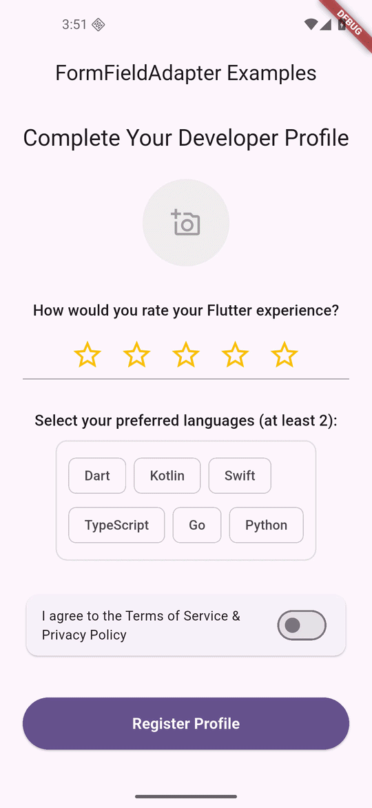

# FormFieldAdapter

[](https://pub.dev/packages/form_field_adapter)
[](https://pub.dev/packages/form_field_adapter)
[](https://github.com/hbsgujjar111/form_field_adapter/blob/master/LICENSE)



An interactive, focus-aware `FormField` wrapper designed for Flutter.

`FormFieldAdapter` simplifies turning any custom input widget (such as rating selectors,
multi-select tag chips, map pin pickers, or image uploaders) into a fully integrated form field with
validation, animated visual feedback, and zero boilerplate.

---

## 🚀 Features

* **State-Based Animated Decorations**: Smoothly morphs between four custom `Decoration` states (
  *Normal*, *Focused*, *Error*, and *Focused Error*).
* **Shake Animation**: Naturally shakes the input container horizontally when validation fails to
  instantly capture user attention.
* **Haptic Feedback**: Triggers a subtle, light device vibration whenever an error is first caught.
* **Focus Node Integration**: Automatically listens to a standard Flutter `FocusNode` to trigger
  active/idle styling changes.
* **Flexible Error Placement**: Choose whether standard error messages should appear above the
  field, below the field, or be hidden entirely (to display custom alert layouts instead).
* **Flexible Layout Alignment**: Align the entire wrapper and its error text to the `start`,
  `center`, or `end` to support centered widgets like profile avatars and rating bars.
* **Automatic Theme Integration**: Safely falls back to your app's existing `ThemeData` properties (
  including error color, error text typography, and standard input border behaviors) if custom
  values aren't passed.
* **Universal Compatibility**: Works on mobile, tablet, desktop, and web.

---

## 📦 Installation

Add `form_field_adapter` to your `pubspec.yaml` dependencies:

```yaml
dependencies:
  form_field_adapter: ^1.0.0
```

And run:

```bash
flutter pub get
```

---

## 🛠️ Quick Start

Wrap any interactive widget inside the `FormFieldAdapter` to connect it with your parent `Form`:

```dart
import 'package:flutter/material.dart';
import 'package:form_field_adapter/form_field_adapter.dart';

final _formKey = GlobalKey<FormState>();
final _myFocusNode = FocusNode();
int _userRating = 0;

Widget build(BuildContext context) {
  return Form(
    key: _formKey,
    child: Column(
      children: [
        FormFieldAdapter<int>(
          initialValue: _userRating,
          focusNode: _myFocusNode,
          validator: (value) => (value == null || value < 3) ? 'Must rate at least 3 stars!' : null,
          onSaved: (value) => _userRating = value ?? 0,
          builder: (state) {
            return Focus(
              focusNode: _myFocusNode,
              child: Row(
                mainAxisAlignment: MainAxisAlignment.center,
                children: List.generate(5, (index) {
                  return IconButton(
                    icon: Icon(
                      index < (state.value ?? 0) ? Icons.star : Icons.star_border,
                      color: Colors.amber,
                    ),
                    onPressed: () {
                      state.didChange(index + 1);
                      _myFocusNode.requestFocus();
                    },
                  );
                }),
              ),
            );
          },
        ),

        ElevatedButton(
          onPressed: () {
            if (_formKey.currentState!.validate()) {
              _formKey.currentState!.save();
              print("Validation passed! Rating is $_userRating");
            }
          },
          child: const Text('Submit'),
        ),
      ],
    ),
  );
}
```

---

## 🎨 Advanced Customization

For full-control designs, wrap your custom widgets inside a builder method to satisfy your design
requirements:

```dart
import 'package:flutter/material.dart';
import 'package:form_field_adapter/form_field_adapter.dart';

Widget buildCustomAdapter(FocusNode myFocusNode) {
  return FormFieldAdapter<String?>(
    focusNode: myFocusNode,
    errorPosition: ErrorPosition.top,
    // Places the error text above the input
    enableHaptics: true,
    // Enable device vibrations
    enableShake: true,
    // Enable failure shake animation

    // Design completely custom border styles
    normalDecoration: BoxDecoration(
      borderRadius: BorderRadius.circular(8),
      border: Border.all(color: Colors.grey.shade300),
    ),
    focusedDecoration: BoxDecoration(
      borderRadius: BorderRadius.circular(8),
      border: Border.all(color: Colors.deepPurple, width: 2),
    ),
    errorDecoration: BoxDecoration(
      borderRadius: BorderRadius.circular(8),
      border: Border.all(color: Colors.red, width: 1.5),
    ),
    builder: (state) {
      return const SizedBox.shrink(); // Replace with your custom widget
    },
  );
}
```

---

## ⚙️ Properties

| Property                 | Type                                     | Default                          | Description                                                                           |
|:-------------------------|:-----------------------------------------|:---------------------------------|:--------------------------------------------------------------------------------------|
| `builder`                | `Widget Function(FormFieldState)`        | *Required*                       | Renders your custom input widget.                                                     |
| `focusNode`              | `FocusNode?`                             | `null`                           | Optional focus node to track the active/idle focus changes of your custom widget.     |
| `normalDecoration`       | `Decoration?`                            | `null`                           | Style applied when the field is enabled, valid, and not focused.                      |
| `focusedDecoration`      | `Decoration?`                            | `null`                           | Style applied when the field is enabled, valid, and focused.                          |
| `errorDecoration`        | `Decoration?`                            | `null`                           | Style applied when the field has a validation error and is not focused.               |
| `focusedErrorDecoration` | `Decoration?`                            | `null`                           | Style applied when the field has a validation error and is focused.                   |
| `decorationPlacement`    | `DecorationPlacement`                    | `DecorationPlacement.background` | Renders decoration behind (`background`) or as a stack overlay (`foreground`).        |
| `enableShake`            | `bool`                                   | `true`                           | Triggers a horizontal shake animation on validation error.                            |
| `enableHaptics`          | `bool`                                   | `true`                           | Triggers light haptic feedback on devices on validation error.                        |
| `animationDuration`      | `Duration`                               | `200ms`                          | Transition duration between the decoration states.                                    |
| `crossAxisAlignment`     | `CrossAxisAlignment`                     | `CrossAxisAlignment.start`       | Aligns the outer layout container (`start`, `center`, or `end`).                      |
| `errorTextAlign`         | `TextAlign?`                             | `null`                           | Custom error text alignment. Automatically matches `crossAxisAlignment` if left null. |
| `errorPosition`          | `ErrorPosition`                          | `ErrorPosition.bottom`           | Location of the error message (`top`, `bottom`, or `none`).                           |
| `errorTextStyle`         | `TextStyle?`                             | `null`                           | Typography for the validation error message.                                          |
| `errorPadding`           | `EdgeInsetsGeometry?`                    | `null`                           | Custom margins surrounding the validation error message.                              |
| `errorBuilder`           | `Widget Function(BuildContext, String)?` | `null`                           | Completely custom render callback for the error layout.                               |

---

## 💻 Platforms Supported

* iOS
* Android
* Web
* macOS
* Windows
* Linux

---

## 🤝 Contributions Welcome

Found a bug or want to improve this widget? Open an issue or pull request on GitHub:
**[github.com/hbsgujjar111/form_field_adapter](https://github.com/hbsgujjar111/form_field_adapter)**

---

## 📄 License

This project is licensed under the MIT License - see the LICENSE file for details.